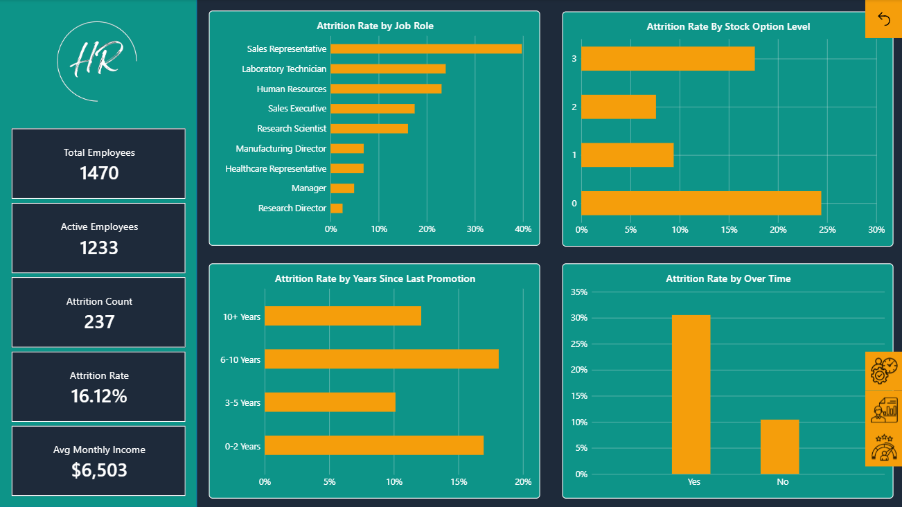
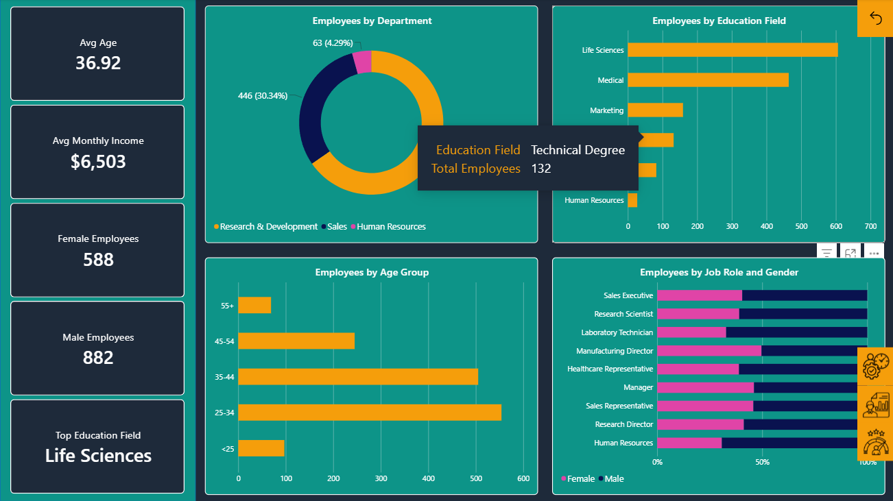
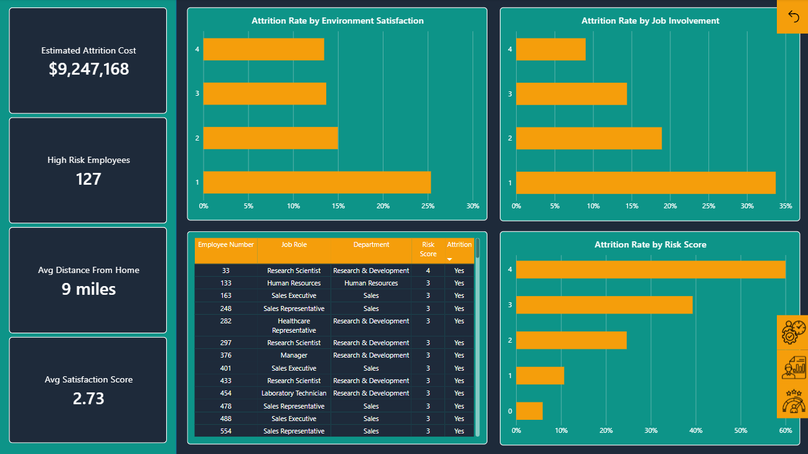

# İnsan Kaynakları Analitik Dashboard | Power BI

Bu proje, IBM HR Analytics veri seti kullanılarak hazırlanmış 
çok sayfalı bir Power BI raporudur. Temel amaç, çalışan kaybını 
(attrition) analiz etmek ve yüksek riskli çalışanları belirlemektir.

📄 [Click here for English README](README.md)

## Sayfalar

### 1. Attrition Overview
Departman, iş rolü, fazla mesai, hisse senedi opsiyonu ve 
terfi süreci bazında attrition analizi.

### 2. Employee Demographics
Yaş dağılımı, cinsiyet, departman ve eğitim alanı bazında 
çalışan profili analizi.

### 3. Satisfaction & Risk Factors
Birleştirilmiş risk skoru modeli, çevre memnuniyeti, iş 
bağlılığı ve tahmini attrition maliyeti analizi.

## Öne Çıkan Özellikler

- **Risk Score Modeli**: Her çalışan için 0-4 arası risk skoru 
  (fazla mesai, hisse opsiyonu, terfi süreci, iş memnuniyeti)
- **Tahmini Attrition Maliyeti**: $9.2M yıllık maliyet tahmini
- **Yüksek Riskli Çalışan Tablosu**: HR ekibinin direkt aksiyon 
  alabileceği 127 çalışan listesi
- 3 sayfalı interaktif navigasyon

## Kullanılan Araçlar

- Power BI Desktop
- DAX
- Power Query

## Veri Kaynağı

IBM HR Analytics Employee Attrition Dataset — Kaggle
